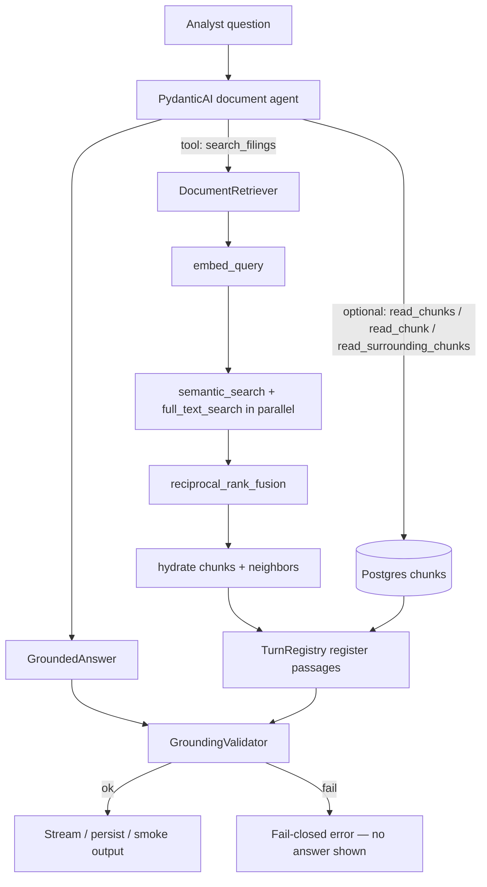

# Research pipeline: retrieval → agent → grounding

End-to-end flow for answering analyst questions from SEC filing chunks. Retrieval finds candidate passages; the PydanticAI agent reads them via tools and produces a structured answer; grounding validates that every citation is real before the response is shown or persisted.

Retrieval-specific settings and SQL details live in [`../retrieval/README.md`](../retrieval/README.md).

## Full pipeline

The turn starts in `agent.py`, where `run_document_agent` sends the analyst's question to the PydanticAI agent with the product contract from `instructions.md` and the four retrieval tools from `tools.py`. The instructions tell the model to call `search_filings` first; that tool delegates to `../retrieval/retriever.py`, which embeds the query, extracts full-text keywords, runs semantic and Postgres full-text search in parallel, fuses the rankings, hydrates the winning chunks, and includes nearby neighbor chunks by default. The agent then decides whether the returned excerpts are enough to answer: if they are, it can produce the final `GroundedAnswer`; if not, it can call `read_chunks`/`read_chunk` for full chunk text, or `read_surrounding_chunks` only when it needs more adjacent context than the search result neighbors already provided. Every tool response is registered in `TurnRegistry` from `deps.py`, so the final citations are limited to chunks actually retrieved during that turn. After the agent returns, `../grounding/validator.py` compares the structured answer against that registry: it checks the answer/citation contract, verifies every `[n]` marker has a matching citation, rejects chunk IDs that were never retrieved, and requires each excerpt to be copied verbatim from the registered chunk text before the chat layer is allowed to stream or persist the answer.



## Agent layer

`DocumentRetriever` is wrapped by four tools in `tools.py`:

| Tool | Purpose |
| --- | --- |
| `search_filings` | Hybrid retrieval with optional `ticker`, `form`, `fiscal_years` filters |
| `read_chunks` | Batch-fetch full text for multiple chunk UUIDs in one DB round-trip |
| `read_chunk` | Fetch a single chunk by UUID |
| `read_surrounding_chunks` | Fetch adjacent chunks within the same filing |

Every tool registers returned passages in `TurnRegistry` (`deps.py`). That registry is the **citation allowlist** for the turn — only chunk IDs registered here may appear in the final answer.

### Parallelism

| Layer | What runs in parallel |
| --- | --- |
| Retrieval | `semantic_search` and `full_text_search` use separate DB sessions in a thread pool |
| Agent tools | PydanticAI executes all tool calls from a single model response concurrently (`asyncio.to_thread`) |
| LLM rounds | Still sequential — each model response waits for tool results before the next request |

Most wall time is LLM latency (especially the final structured `GroundedAnswer`), not retrieval or DB I/O. Instructions steer the agent to answer from `search_filings` excerpts when possible, batch reads via `read_chunks`, and avoid redundant follow-up tool rounds.

### Structured output

The agent returns `GroundedAnswer` (`outputs.py`):

- `answer` — plain text with `[1]`, `[2]`, … markers
- `citations` — `{citation_index, chunk_id, excerpt}` per cited claim
- `insufficient_evidence` — when the corpus cannot support an answer (must have empty citations)

## Grounding

`GroundingValidator` (`grounding/validator.py`) runs **after** the agent finishes. It is fail-closed: a failed validation means the chat orchestrator streams an error instead of the answer.

### Checks performed

1. **Non-empty answer** — blank `answer` text fails.
2. **Insufficient-evidence contract** — when `insufficient_evidence=true`, citations must be empty; when `false`, at least one citation is required.
3. **Registry populated** — citations cannot exist if no passages were retrieved.
4. **Citation indices** — must be unique, 1-based, and contiguous (`1..N`).
5. **Marker alignment** — every `[n]` in `answer` must match a `citation_index`, and vice versa.
6. **Chunk allowlist** — each `citation.chunk_id` must exist in `TurnRegistry.passages_by_chunk_id`.
7. **Verbatim excerpts** — each `citation.excerpt` (whitespace-normalized) must be a substring of the retrieved chunk text. The model cannot paraphrase in excerpt fields.

### Where validation runs

| Entry point | Behavior on failure |
| --- | --- |
| `chat/orchestrator.py` | SSE error event; turn not persisted as a grounded answer |
| `scripts/smoke_assistant.py` | Prints `validation_ok: false` and the error message |

Grounding does **not** re-retrieve or re-score passages. It only checks that the model stayed inside the evidence boundary established by tool calls during the turn.

## Progress logging (smoke / Jupyter)

`progress.py` exposes optional listeners. `scripts/smoke_assistant.py` registers a listener that prints timestamped lines (flushed) for:

- Agent start and completion (request count, token usage)
- Each tool start and finish (duration, result count)
- Grounding validation result

In Jupyter, call `setup_progress_logging()` before `run_document_agent` (or run the smoke script as-is) so the cell shows live progress instead of appearing hung.

## Module map

| Path | Responsibility |
| --- | --- |
| `agent.py` | PydanticAI agent definition and `run_document_agent` |
| `tools.py` | Retrieval-backed tools + registry registration |
| `deps.py` | `DocumentAgentDeps`, `TurnRegistry` |
| `outputs.py` | `GroundedAnswer`, `Citation` |
| `instructions.md` | System prompt / product contract |
| `progress.py` | Optional progress listeners |
| `../retrieval/` | Hybrid search implementation |
| `../grounding/validator.py` | Post-agent citation validation |
| `../chat/orchestrator.py` | Agent → validate → stream → persist |

## Smoke test

From `backend/`:

```bash
uv run python -u scripts/smoke_assistant.py
```

Edit `QUERY_KEY` at the top of the script to switch between canned queries. Use `-u` for unbuffered stdout in terminals; the script already flushes prints for Jupyter.
