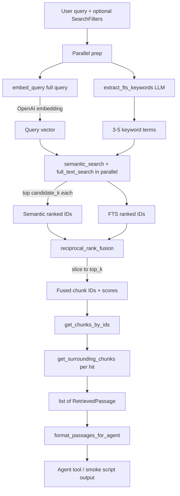

# Retrieval

Hybrid search over SEC filing chunks stored in Supabase Postgres. For the full path from analyst question through agent tools to grounding validation, see [`../assistant/README.md`](../assistant/README.md). Each query runs **semantic** (pgvector) and **keyword** (full-text) searches in parallel, fuses the ranked lists with **Reciprocal Rank Fusion (RRF)**, then hydrates the top hits with document metadata and optional neighboring chunks for context.

## Pipeline



### Step-by-step

1. **Parallel prep** — `embed_query` embeds the **full** user query for semantic search. In parallel, `keywords.extract_fts_keywords` uses a small OpenAI model to distill 3–5 domain terms for full-text search (skipped for short, keyword-like queries). Search filters (e.g. ticker) are passed into extraction so redundant company names can be omitted.

2. **Dual search (parallel)** — `retriever._dual_search` runs semantic and full-text queries concurrently, each on its own DB session. Semantic search orders by pgvector cosine distance (`<=>`); score is `1 - distance`. Full-text search runs `plainto_tsquery` on the extracted keyword string against the ingest-generated `search_vector` column and ranks with `ts_rank_cd`. Both return up to `candidate_k` hits.

4. **Fusion** — `fusion.reciprocal_rank_fusion` merges the two ID lists. Each appearance at rank `r` (1-based) adds `1 / (k + r)` to that chunk's score. Results are sorted by total score descending; the list is truncated to `top_k`.

5. **Hydrate** — `retriever.DocumentRetriever` loads full chunk rows (with parent document) for fused IDs, preserving fusion order.

6. **Neighbors** — When `include_neighbors=True` (default), each hit fetches adjacent chunks within `retrieval_neighbor_radius` indices in the same document. Neighbors are attached to the parent passage with `fusion_score=0.0` and are deduplicated across hits.

7. **Format** — `types.format_passages_for_agent` turns passages into bounded, grep-style text for agent tools (excerpt and total output caps below).

## Default settings

All retrieval tuning lives in `app/config.py` and can be overridden via environment variables (same field names, e.g. `RETRIEVAL_TOP_K=15`).

| Setting | Default | Role |
| --- | --- | --- |
| `retrieval_candidate_k` | `50` | Max hits fetched from **each** search path before fusion |
| `retrieval_top_k` | `10` | Final number of fused passages returned |
| `retrieval_rrf_k` | `60` | RRF constant `k` in `1 / (k + rank)` |
| `retrieval_neighbor_radius` | `1` | Chunks before/after each hit to include (same document, by `chunk_index`) |
| `retrieval_fts_config` | `"english"` | Postgres text search config for `plainto_tsquery` |
| `retrieval_fts_keyword_model` | `"gpt-4.1-mini"` | Small model for FTS keyword extraction |
| `retrieval_fts_keyword_min` | `3` | Minimum extracted FTS terms |
| `retrieval_fts_keyword_max` | `5` | Maximum extracted FTS terms |
| `retrieval_fts_keyword_fast_path_tokens` | `5` | Skip keyword LLM when query is this short |
| `openai_embedding_model` | `"text-embedding-3-small"` | Model used for live query embeddings |
| `openai_embedding_dimensions` | `1536` | Embedding width; must match ingested chunk vectors |

### `DocumentRetriever.search` parameters

| Parameter | Default | Role |
| --- | --- | --- |
| `filters` | `None` | Optional `SearchFilters` (see below) |
| `top_k` | `settings.retrieval_top_k` | Override fused result count |
| `candidate_k` | `settings.retrieval_candidate_k` | Override per-path candidate pool |
| `include_neighbors` | `True` | Attach surrounding chunks to each hit |
| `session` | auto | Pass a SQLAlchemy session or let the retriever open one |

### Output formatting limits (`types.py`)

| Constant | Value | Role |
| --- | --- | --- |
| `MAX_PASSAGE_EXCERPT_CHARS` | `800` | Max characters per passage (or neighbor) in agent output |
| `MAX_AGENT_OUTPUT_CHARS` | `12_000` | Max total characters from `format_passages_for_agent` |

## Search filters

`SearchFilters` optionally narrows both semantic and FTS queries:

| Field | Type | SQL effect |
| --- | --- | --- |
| `ticker` | `str \| None` | `sd.ticker = :ticker` |
| `fiscal_years` | `list[int] \| None` | `sd.fiscal_year = ANY(:fiscal_years)` |
| `form` | `str \| None` | `sd.form = :form` |

Unset fields apply no filter. Filters are ANDed together.

## Module map

| File | Responsibility |
| --- | --- |
| `retriever.py` | `DocumentRetriever` orchestrator: embed → search → fuse → hydrate |
| `embeddings.py` | OpenAI query embedding |
| `keywords.py` | LLM keyword extraction for full-text search |
| `queries.py` | pgvector semantic search + Postgres FTS SQL |
| `fusion.py` | Reciprocal Rank Fusion |
| `types.py` | `SearchFilters`, `RetrievedPassage`, agent formatting helpers |

## Quick smoke test

From `backend/`:

```bash
uv run python -m scripts.smoke_retrieval
```

The script runs three ticker-scoped 10-K questions through `DocumentRetriever` and prints `format_passages_for_agent` output.

## RRF in brief

Given rankings `[semantic_ids, fts_ids]` and constant `k`:

```
score(chunk) = Σ  1 / (k + rank_in_list)
```

A chunk that ranks well in **both** lists accumulates a higher score than a chunk that only appears in one. Default `k=60` follows the common RRF literature value and dampens the influence of top ranks vs. lower ranks.
